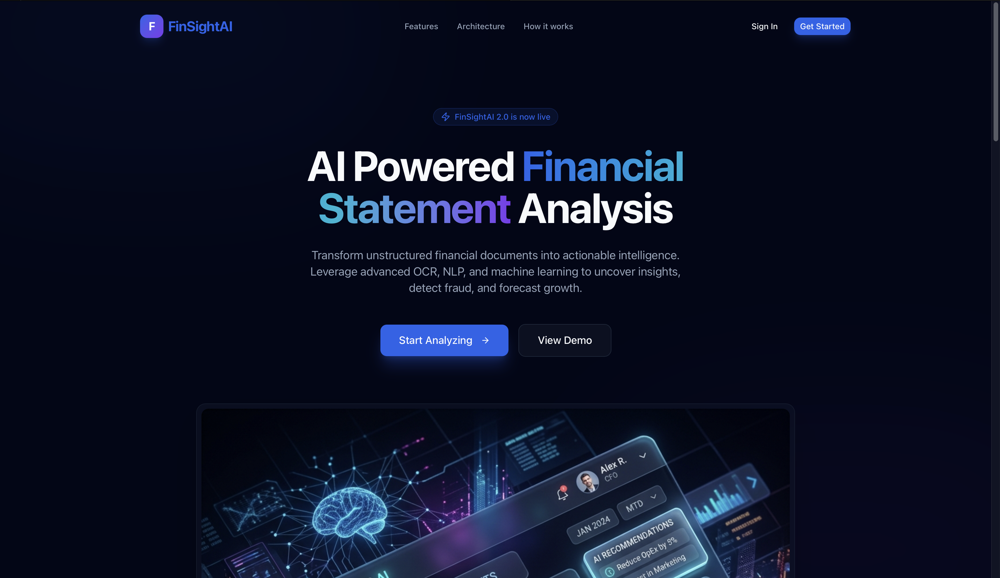
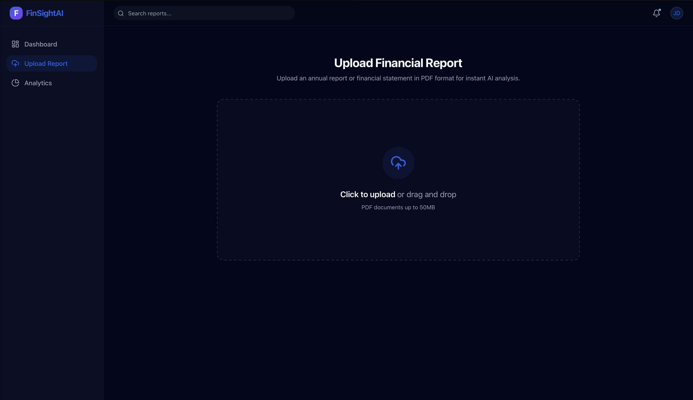
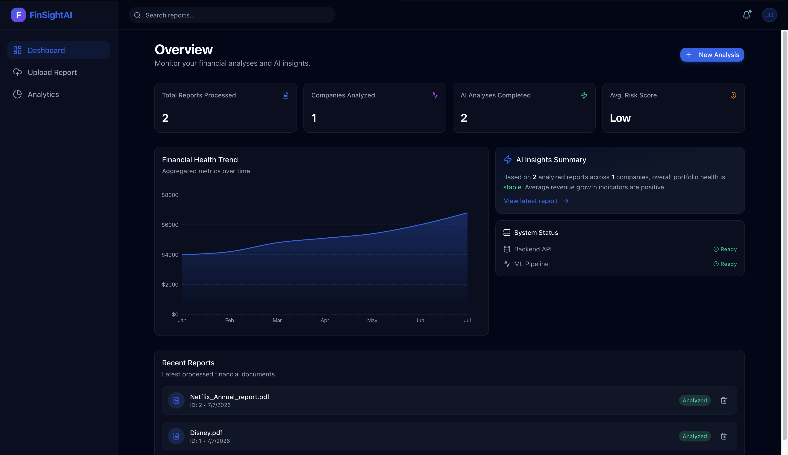
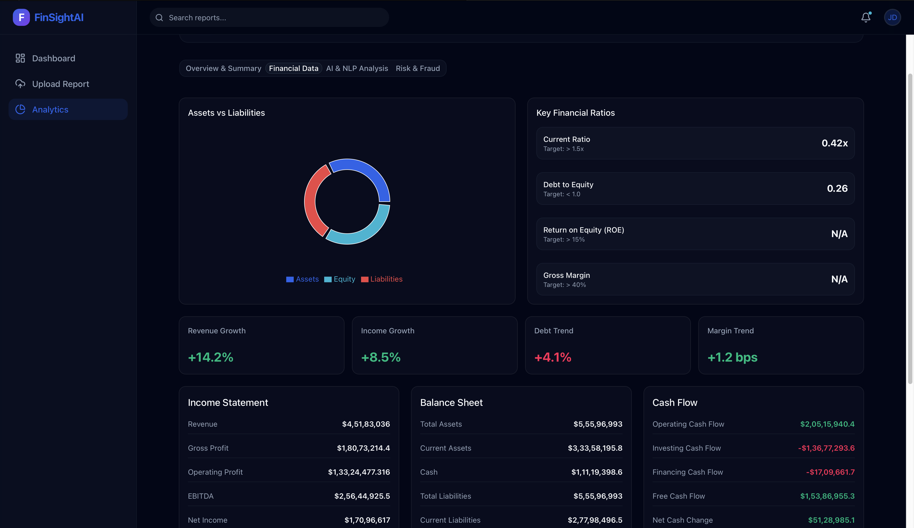

# 🚀 FinSightAI

<h3 align="center">
AI-Powered Financial Statement Analysis Platform
</h3>

<p align="center">


</p>

<p align="center">
<b>Transform Financial Reports into AI-Powered Business Intelligence</b><br>
OCR • NLP • Financial Analytics • Fraud Detection • Risk Prediction • Forecasting
</p>

---

# 📖 Overview

**FinSightAI** is an end-to-end AI-powered financial statement analysis platform that automatically converts lengthy financial reports into meaningful insights using Artificial Intelligence, Machine Learning, Natural Language Processing, and Financial Analytics.

Instead of manually reviewing hundreds of pages of annual reports, balance sheets, or SEC filings, users simply upload a PDF and receive a comprehensive AI-generated analysis including executive summaries, financial ratios, fraud detection, bankruptcy risk prediction, forecasting, and interactive dashboards.

The project combines modern web technologies with machine learning models to provide enterprise-grade financial intelligence in an intuitive and user-friendly interface.

---

# ✨ Features

## 📄 Intelligent Document Processing

- Upload PDF Financial Reports
- OCR Text Extraction
- Automatic Document Parsing
- Financial Data Extraction
- Company Information Recognition

---

## 🤖 AI & NLP Analysis

- AI Executive Summary
- Named Entity Recognition
- Financial Keyword Extraction
- Sentence Processing
- Tokenization
- Lemmatization
- Stopword Removal
- NLP Pipeline

---

## 📊 Financial Analysis

Automatically extracts and analyzes

- Revenue
- Net Income
- Operating Income
- Total Assets
- Total Liabilities
- Shareholder Equity
- Cash
- Debt
- Inventory
- Receivables
- Cash Flow

---

## 📈 Financial Ratio Analysis

Calculates multiple financial ratios including

- Current Ratio
- Quick Ratio
- Cash Ratio
- Return on Assets (ROA)
- Return on Equity (ROE)
- Net Profit Margin
- Gross Margin
- Operating Margin
- Debt-to-Equity
- Debt-to-Assets
- Asset Turnover
- Inventory Turnover
- Earnings Per Share (EPS)
- Book Value Per Share
- Health Score

---

## 🚨 Fraud Detection

Machine Learning based fraud detection system featuring

- Fraud Probability Prediction
- Financial Anomaly Detection
- Benford's Law Analysis
- Fraud Confidence Score
- AI Recommendations

---

## ⚠ Risk Prediction

Predict financial health using Machine Learning.

Includes

- Bankruptcy Prediction
- Financial Distress Detection
- Confidence Score
- Risk Classification
- AI Recommendations

---

## 📉 Financial Forecasting

Forecast future financial performance using

- Prophet
- ARIMA
- Growth Projection Models

Provides

- Future Trend Analysis
- Revenue Forecast
- Interactive Charts
- Confidence Intervals

---

## 📊 Interactive Analytics Dashboard

Modern Bloomberg-inspired dashboard with

- Executive Summary
- KPI Cards
- Financial Charts
- Forecast Visualizations
- Fraud Dashboard
- Risk Dashboard
- Financial Analytics
- Interactive Graphs

---

# 🖼 Application Preview

## 🏠 Landing Page



---

## 📤 Upload Financial Report



---

## 📊 AI Analytics Dashboard



---

## 📈 Financial Analysis



---

# ⚙ Tech Stack

## Frontend

- React
- TypeScript
- Tailwind CSS
- Vite
- Recharts
- React Router

---

## Backend

- FastAPI
- SQLAlchemy
- SQLite
- Pydantic
- Uvicorn

---

## Artificial Intelligence

- Scikit-learn
- Prophet
- ARIMA
- Pandas
- NumPy
- spaCy
- NLTK

---

## OCR & NLP

- Tesseract OCR
- PyMuPDF
- spaCy
- NLTK

---

# 🧠 Machine Learning Models

| Model | Purpose |
|--------|---------|
| Random Forest | Financial Risk Prediction |
| Fraud Detection Model | Fraud Classification |
| Prophet | Time-Series Forecasting |
| ARIMA | Trend Forecasting |
| NLP Pipeline | Financial Text Analysis |

---

# 🚀 Project Workflow

```text
Upload PDF
      │
      ▼
OCR Extraction
      │
      ▼
NLP Processing
      │
      ▼
Financial Data Extraction
      │
      ▼
Financial Ratio Calculation
      │
      ▼
Fraud Detection
      │
      ▼
Risk Prediction
      │
      ▼
Forecast Generation
      │
      ▼
Interactive Dashboard
```

---

# 📂 Project Structure

```text
FinSightAI
│
├── backend
│   ├── app
│   ├── api
│   ├── services
│   ├── models
│   ├── ml
│   └── trained_models
│
├── frontend
│   ├── src
│   ├── components
│   ├── pages
│   └── assets
│
├── notebooks
│
├── datasets
│
└── Frontend_Images
```

---

# 🎯 Use Cases

- Financial Statement Analysis
- Investment Research
- Fraud Detection
- Bankruptcy Prediction
- Financial Health Monitoring
- Company Performance Evaluation
- Academic Research
- Financial Auditing
- Portfolio Analysis

---

# 🌟 Project Highlights

- End-to-End AI Financial Analysis
- Modern Professional Dashboard
- Machine Learning Powered Predictions
- OCR + NLP Pipeline
- Financial Ratio Analysis
- Fraud Detection Engine
- Risk Prediction Engine
- Financial Forecasting
- Interactive Charts
- Responsive UI
- Clean REST APIs
- Modular Backend Architecture

---

# 📈 Future Improvements

- Authentication & User Management
- Multi-user Workspace
- Multi-language OCR
- RAG-powered Financial Chatbot
- Stock Market API Integration
- Real-time Company Data
- Cloud Deployment
- PDF Report Export
- Explainable AI (XAI)
- Portfolio Management

---

# 👨‍💻 Author

**Arpit Pandey**

B.Tech Computer Science Engineering

Artificial Intelligence • Machine Learning • Backend Development • Software Engineering

---

# ⭐ Support

If you found this project useful, please consider giving it a **⭐ Star** on GitHub.

It helps the project reach more developers and motivates future improvements.

---

<p align="center">

### 🚀 Built with ❤️ using Artificial Intelligence, Machine Learning, and Modern Web Technologies.

</p>
